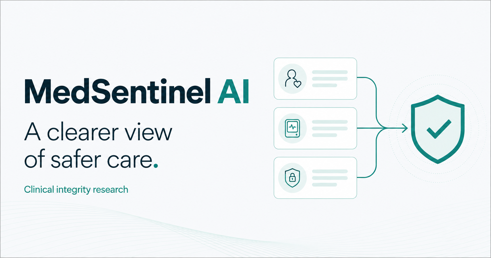
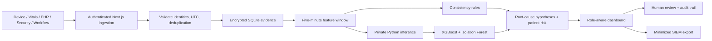

# MedSentinel AI



[](https://github.com/TarunRam-git/medsentinel-ai/actions/workflows/ci.yml)

An evidence-led clinical integrity and cyber-physical security **research prototype** for smart hospitals. Built from the supplied MedSentinel AI project documentation using **Next.js 16, React 19, TypeScript, SQLite, and a Python machine-learning service**.

It connects patient context, medical-device telemetry, EHR intent, security signals, and workflow events. Staff can inspect an alert, compare competing causes, review transparent patient-risk factors, and record a human decision.

**This is not a validated medical device.** The included patients and model-training data are synthetic. The app never changes therapy, device settings, or network controls.

## What works

- Responsive overview, searchable/filterable alert queue, patient context, device inventory, model insights, integration documentation, and audit history.
- Administrator patient/device registration, identity association validation, and operator account provisioning.
- Five enforced roles: administrator, clinician, security, biomedical, and researcher.
- Password authentication, persistent opaque sessions, logout/revocation, origin checks, request-size limits, schema validation, and database-backed rate limiting.
- Encrypted evidence payloads, append-only audit rows, and keyed audit-chain verification.
- UTC-normalized event ingestion, deduplication, source provenance, and five-minute correlation windows.
- Order/device, vital-signal, device-health, and network consistency rules. Five ranked root-cause hypotheses and a separate patient-risk score.
- Human acknowledgement, investigation, resolution, and false-positive feedback with optimistic concurrency checks.
- Actual XGBoost and Isolation Forest inference, Random Forest benchmarking, tree feature contributions, and grouped synthetic evaluation.
- A FHIR R4 Observation adapter and minimized, downloadable SIEM JSON.
- Production build, automated engine/API/model tests, GitHub Actions, and persistent-volume Docker deployment files.

## Run locally

Requires Node **22.13+** (24 LTS recommended), npm, and writable local disk. Python **3.14** is used for the optional model service.

```bash
git clone https://github.com/TarunRam-git/medsentinel-ai.git
cd medsentinel-ai
npm ci
npm run setup
npm run dev
```

Open **http://localhost:3000** and choose **Enter demo workspace**. Choose any role to explore its permissions.

Setup creates an ignored, permission-restricted `.env.local` with unique secrets and enables a **synthetic local demo**. It preserves an existing environment file. Administrator password sign-in uses the email/password in that file; there is no public default password. Do not commit or share it.

If port 3000 is occupied, use `npm run dev -- --port 3001` and change `APP_ORIGIN` in `.env.local` to the exact URL you will open. Origin checks deliberately reject mismatched origins.

### Enable machine learning

The app works in explicitly labeled **rules-only mode** without Python. To enable actual model inference:

```bash
python3.14 -m venv .venv
.venv/bin/pip install -r ml/requirements.txt
npm run ml:train
npm run ml:serve
```

Keep the model service running in a second terminal. Model insights displays its health and evaluation report. Run a new scenario to generate model-backed alerts; seeded alerts retain their original rules-only provenance.

Model artifacts live in ignored `ml/artifacts/`. The service listens on loopback port 8001 and requires its own bearer secret.

### Explore the workflow

1. Open an integrity alert and review its evidence timeline, competing causes, patient-risk factors, and recommended verification steps.
2. Enter a review note and acknowledge the alert. Investigate or resolve it through the permitted state transitions.
3. As administrator or researcher in demo mode, run a controlled scenario against an associated patient/device. New events persist and are audited.
4. Filter by department, severity, status, or text. Patient and device cards link to their related alerts.
5. Open Model insights for measured benchmark results, or Audit trail to verify recorded actions.
6. Export SIEM summaries as administrator, security, or a demo researcher.

The benign scenario does not automatically dismiss an existing alert. Old adverse evidence remains in its correlation window until it ages out; human review is required for resolution.

## Architecture



The Node application owns authentication, authorization, persistence, event correlation, workflow, and audit. The Python service scores normalized feature vectors; it receives no names or raw clinical records. Model service failures degrade to rules-only operation, with provenance shown on each alert.

## Reproducible evaluation

`npm run ml:train` generates 3,200 observations across 800 synthetic scenario/device groups, with a 75/25 **grouped** split and seed 42. No group appears in both partitions.

The report contains precision, recall, F1, AUROC, AUPRC, Brier score, expected calibration error, false-positive rate, and a security-only ablation. The example synthetic XGBoost F1 is approximately **0.960**. This verifies the experiment pipeline; it does **not** demonstrate real-hospital performance or clinical calibration.

For authorized external data, supply a normalized CSV:

```bash
.venv/bin/python -m ml.train --csv /path/to/authorized-features.csv
```

Required columns: `orderMismatch,vitalDiscordance,authFailures,packetLoss,deviceError,configChange,latency,signalQuality,label,group`. Features must be finite in [0,1], labels binary, and groups independent patient/device/scenario identifiers. Feature mapping, train/test governance, and authorization are the operator's responsibility.

WUSTL-EHMS-2020, CICIoMT2024, MIMIC-IV, TON_IoT, and UNSW-NB15 are evaluation candidates in the project document, **not datasets already evaluated by this repository**. MIMIC-IV requires credentialed access and a data-use agreement. Do not fuse unrelated datasets as if their rows describe the same patients. Prospective delay, false alarms per patient-day, subgroup validation, and clinical calibration remain future validation work.

## Verify

```bash
npm run lint
npm run typecheck
npm test
npm run build
npm run test:api
.venv/bin/python -m unittest ml.test_models
npm audit --audit-level=high
```

Run the production build before API tests. API tests start an isolated production server on an available loopback port, use a temporary database and generated test secrets, and stop the server afterward. They do not modify your demo workspace. Model tests require prior training.

GitHub Actions runs the application and model checks on pushes and pull requests. See [verification notes](docs/VERIFICATION.md) for the browser checks and validation boundaries.

## Deploy

Use a persistent Node host or the provided Docker Compose setup. **Do not deploy this SQLite app onto an ephemeral serverless filesystem.** Use one app instance with a backed-up local volume.

```bash
npm run setup
# Configure .env.local for deployment; use a canonical HTTPS APP_ORIGIN.
docker compose --env-file .env.local up --build -d
```

Compose disables demo mode and binds the web container to loopback port 3000 for a TLS reverse proxy. The model container has no public port. The database uses a named persistent volume.

For a source-based Node deployment: `npm ci && npm run build && npm start`. For a standalone deployment, copy `public/` and `.next/static/` into the corresponding locations under `.next/standalone/`, provide runtime environment variables, and run `node server.js` there. The schema is included in the traced server output.

Provision additional role accounts on the same database:

```bash
npm run user:create -- person@hospital.org "Display Name" clinician
```

The command generates a password and saves it privately beside the database. Use an approved secure channel to deliver credentials. Production researcher access is limited to model insights until governed de-identification is configured. Disabling demo also invalidates existing demo sessions.

The app is not deployed to a public hosting service by this repository. The supplied Node/SQLite runtime cannot be uploaded directly as a Sites Cloudflare Worker.

Read [security and deployment boundaries](docs/SECURITY.md) before using anything other than synthetic data. TLS termination, full-volume encryption, independent immutable audit retention, account lifecycle, institutional authorization, clinical validation, and operational monitoring require deployment work.

## Project structure

```text
src/app/          Next.js routes, authentication pages, API handlers
src/components/   Responsive workspace, login, registration forms
src/lib/          Integrity engine, storage, cryptography, auth, ingestion
db/schema.sql     Versioned SQLite schema and append-only audit triggers
ml/               Training, private inference service, model tests
scripts/          Setup, account provisioning, model launcher, API tests
tests/            Engine, validation, and cryptography tests
docs/             API, security, implementation, verification, storage notes
```

[API contract](docs/API.md) · [Security model](docs/SECURITY.md) · [Implementation scope](docs/IMPLEMENTATION.md) · [Storage inspection](docs/STORAGE-CHECK.md)

The supplied project PDF was read locally and is not redistributed here. UI artwork is generated; see [asset provenance](docs/ASSETS.md). MIT licensed.
